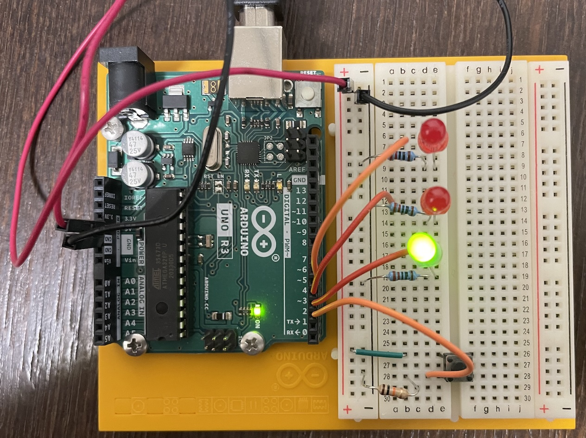

# Arduino: Spaceship Interface (project 2)



Program for Arduino Uno R3. From Arduino Projects Book.

## On Mac

Build with

```bash
./build.sh
```

To test if Arduino is connected:

```bash
avrdude -p atmega328p -c arduino -P /dev/tty.usbmodem1101 -b 115200
```

Flash to Arduino with

```bash
avrdude -p atmega328p -c arduino -P /dev/tty.usbmodem1101 -b 115200 -U flash:w:build/main.hex
```
